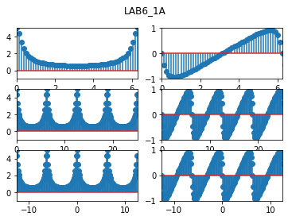
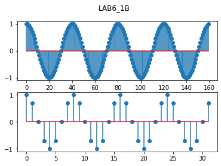
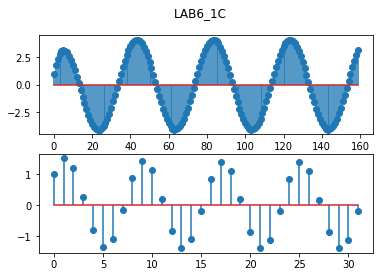
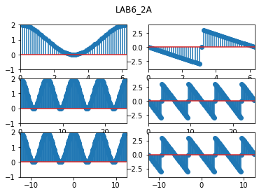
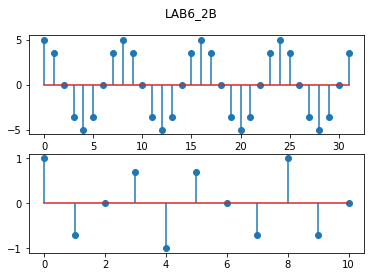
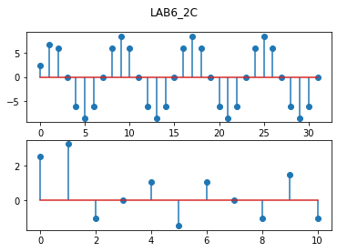
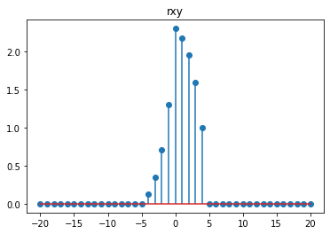
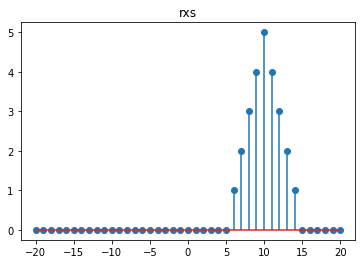
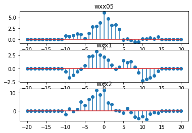
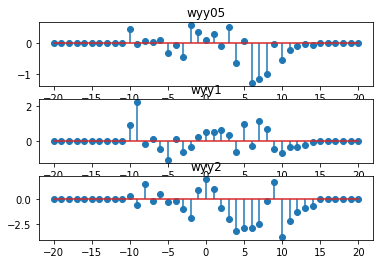

# NYUST_EE_Digital signal analysis and applications
## Course Overview
The aim is for students to understand how to process analog signals digitally after sampling. The learning content includes discrete Fourier transform (DFT), fast Fourier transform (FFT), Z-transform, and the design of FIR and IIR digital filters.  

## LAB
### Week06
#### HW6_1  :For For a linear time-invariant (LTI) system, the input x[n] and the output y[n] satisfy the following difference equation: $\  y[n] = 0.8 y[n-1] + x[n] $   HW6_2: The impulse response of a discrete-time system is $\  h[n]= \frac{1}{2}\delta[n] + \delta[n-1] + \frac{1}{2}\delta[n-2]   $
> (a). Derive the formula for the frequency response and plot it (in magnitude and phase format). Plot it over three different intervals to verify that it is a periodic function.  
> (b).Calculate the output for the input $\  x[n]=cos(0.05πn)u[n]$ and  $\ x[n]=cos(0.25πn)u[n] $ over four oscillation periods. Plot the results and discuss them. Assume $ y[n]=0 $ for any n<0.  
> (c).From the waveforms obtained in (b), verify that the magnitude and delay of the output signal match the values calculated in (a).

#### HW6_3 : $\ s[n]=u[n]- n[n-5] $ , $\ x[n]=s[n-10] $ , $\ t[n]=0.6^n s[n]$ , $\ y[n]=t[n-10] $ 

> (a). Compute cross-correlation $\ r_{xy}[m] $ and autocorrelation $\ r_{xs}[m] $ , $\  -20 \leq m  \leq 20 $  ,  $\  0 \leq n  \leq 20 $   
> (b). Let  $ wx[n] = k*randn(1,21) + x[n] $ , $ wy[n] = k*randn(1,21) + y[n] $ ,Compute separately when $ k=0.5 , 1, 2 $ ,correlation between $ wx[n] $ 、 $ x[n] $  and  $ wy[n] $ 、 $ y[n] $  , $  -20 \leq m  \leq 20 $  .  

### Week07
TODO  
### Week08
TODO 
### Week10
TODO 
### Week11
TODO 
### Week12
TODO 
### Week13
TODO 
### Week14
TODO 
### Week15
TODO 
### Week16
TODO 
### Week17
TODO 
