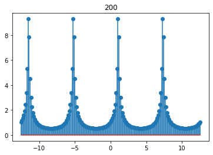
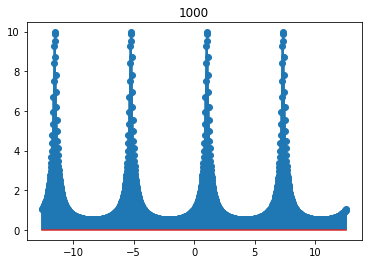
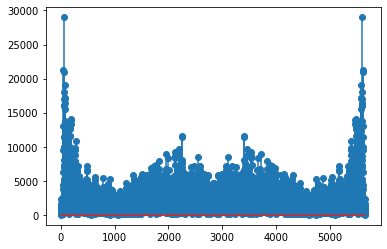
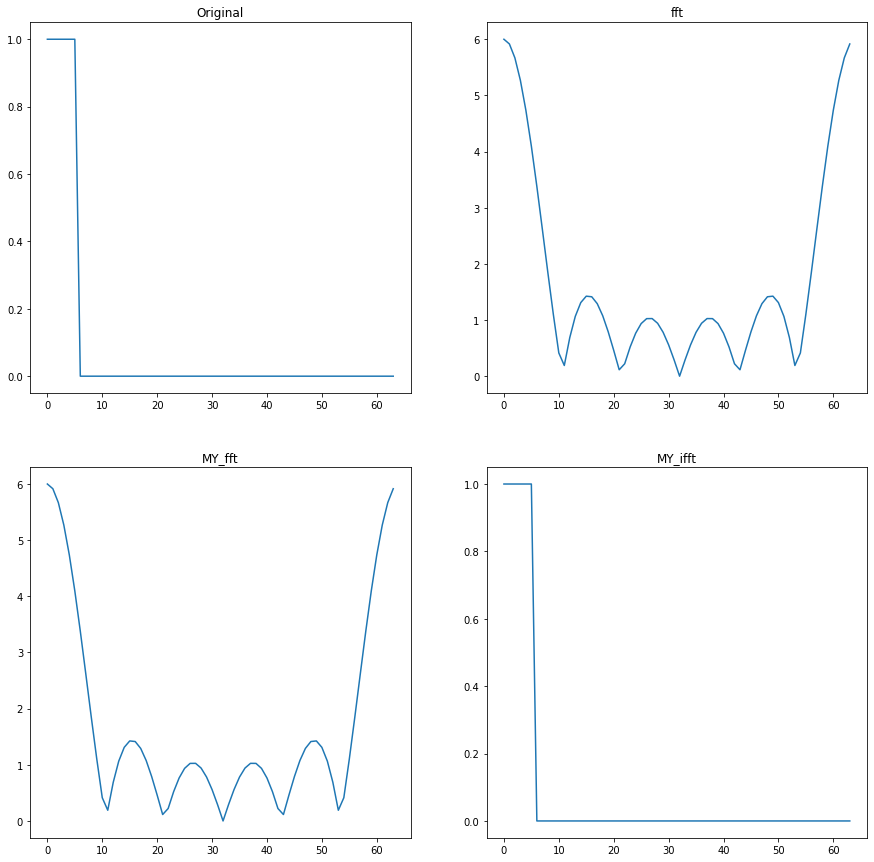
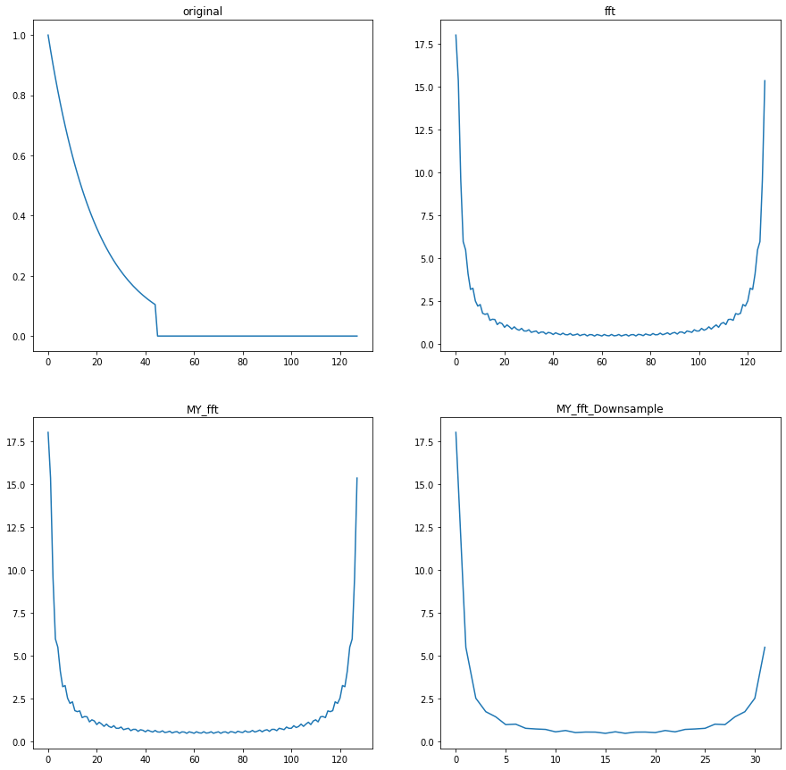
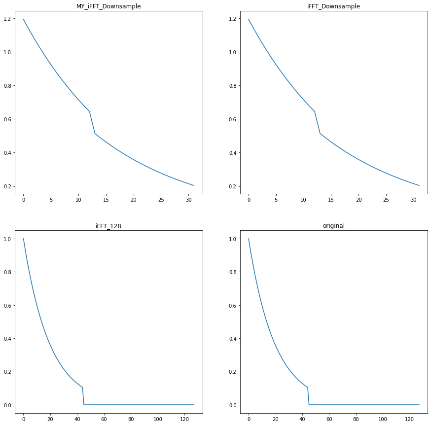

# NYUST_EE_Digital signal analysis and applications
## Course Overview
The aim is for students to understand how to process analog signals digitally after sampling. The learning content includes discrete Fourier transform (DFT), fast Fourier transform (FFT), Z-transform, and the design of FIR and IIR digital filters.  

## LAB
### Week06
#### HW6_1  :For For a linear time-invariant (LTI) system, the input x[n] and the output y[n] satisfy the following difference equation: $$\  y[n] = 0.8 y[n-1] + x[n] $$   HW6_2: The impulse response of a discrete-time system is $$\  h[n]= \frac{1}{2}\delta[n] + \delta[n-1] + \frac{1}{2}\delta[n-2]   $$
> (a). Derive the formula for the frequency response and plot it (in magnitude and phase format). Plot it over three different intervals to verify that it is a periodic function.  
> (b).Calculate the output for the input $\  x[n]=cos(0.05πn)u[n]$  and  $\ x[n]=cos(0.25πn)u[n]$  over four oscillation periods. Plot the results and discuss them. Assume    y[n]=0    for any n<0.  
> (c).From the waveforms obtained in (b), verify that the magnitude and delay of the output signal match the values calculated in (a).

#### HW6_3 : $\ s[n] = u[n]- n[n-5]$ , $\ x[n] = s[n-10]$ , $\ t[n] = 0.6^n s[n]$ , $\ y[n] = t[n-10]$ 

> (a). Compute cross-correlation $\  r_{xy}[m]$ and autocorrelation  $\  r_{xs}[m]$ , $\   -20 \leq m  \leq 20$  ,  $\   0 \leq n  \leq 20$   
> (b). Let  $\ wx[n] = k \* randn(1,21) + x[n]$ , $\ wy[n] = k \* randn(1,21) + y[n]$ ,Compute separately when $\ k=0.5 , 1, 2$ ,correlation between $\ wx[n]$ 、 $\ x[n]$  and  $\ wy[n]$ 、 $\ y[n]$  , $\  -20 \leq m  \leq 20$  .  

### Week07
#### HW7_1 : Same as HW6_3

#### HW7_2 : DTFT by Python: write a function to compute: $$X(\Omega) = \sum_{n=-\infty}^{+\infty} x[n] e^{-j \Omega n} \implies X(\Omega_k) = \sum_{n=-\infty}^{+\infty} x[n] e^{-j \Omega_k n}$$  (choose N=1000 and 200 , then used this function in the HW7_3 and  HW7_4 )    
#### HW7_3 :  $X[n]= \( 0.9e^{  \frac{-j \pi}{3} } \)^n$ ,  Calculate its DTFT $X(e^{j \omega})$ ,and explore the periodicity and symmetry of its magnitude. 
#### HW7_4 : Using the provided audio signals, extract a segment (N=5667). Then, using your previously written DTFT program, calculate and plot its spectrum.  

### Week08
TODO 
### Week10
TODO 
### Week11
Write a Decimation-in-Time FFT function. my_FFT(Xk, N) and  my_IFFT(Xk, N),then Complete HW11_1 and  HW11_2, and compare and verify the results with the built-in FFT function in NumPy.  
####  HW11_1 : x[n]=1 , $\ 0 \leq n  \leq 5$    (a)  Plot FFT(x[n]) using N=64(after proper zero-padding)   (b) Plot IFFT (x[n])  

####  HW11_2 : $\ x[n] = 0.95^n u[n]$ , $\ 0 \leq n  \leq 45$   (a)   Compute FFT(x[n]) using N=128(after proper zero-padding)    (b) Plot x[n], and compare it with IFFT of (a). (plot together)   (c) Downsample (decimate) the FFT of (a) by a factor of 4 , and compute the IFFT (128 points), and plot it with  for a comparison. 

### Week12
TODO 
### Week13
TODO 
### Week14
TODO 
### Week15
TODO 
### Week16 FIR Optimal Filter Design
Design various filters that meet the following specifications using optimal methods and plot the amplitude and phase responses.  
(a) Bandpass $$F_s=8khz$$  $\omega_{1s}=0.1\pi$ , $A_s=60 db$ ,  $\omega_{1p}=0.25 \pi$ , $R_p=1 db$      $\omega_{2p}=0.25\pi$ , $R_p=1 db$  ,  $\omega_{2s}=0.75 \pi$ , $A_s=60 db$

(b) Bandpass     Passband: 900~1100hz    Passband ripple (  $R_p$ ): <0.87dB       Stopband attenuation  ( $A_s$)  : >30dB    Sampling frequency ( $f_s$ ): 15kHz     Transition band: 450Hz.

(c) Lowpass  $f_p=1.5khz$ , $\Delta f =0.5khz$  , $R_p=0.1 db$  , $A_s > 50 db$ ,   $f_s=8 khz$  

(d) Highpass  $$F_s=8khz$$   $\omega_{s}=0.5\pi$ , $A_s=50 db$ ,  $\omega_{p}=0.65 \pi$ , $R_p=0.5 db$   

### Week17
TODO 
